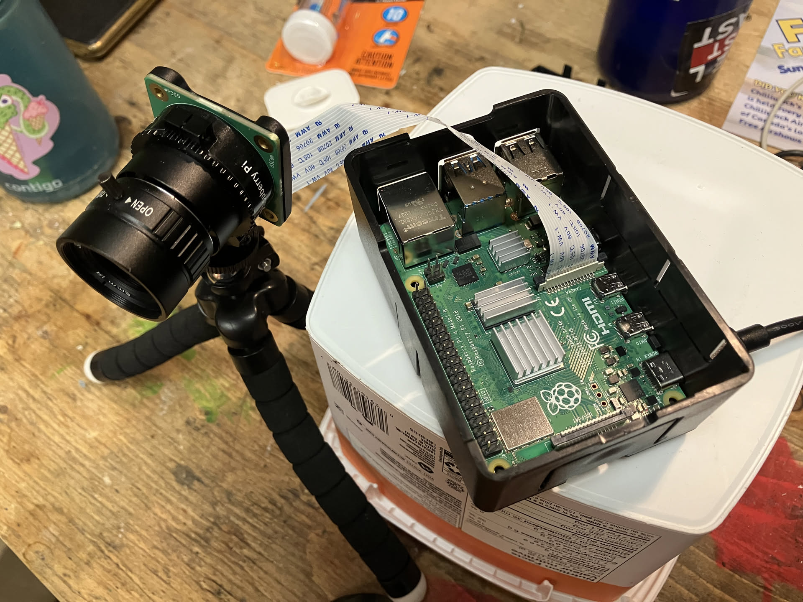
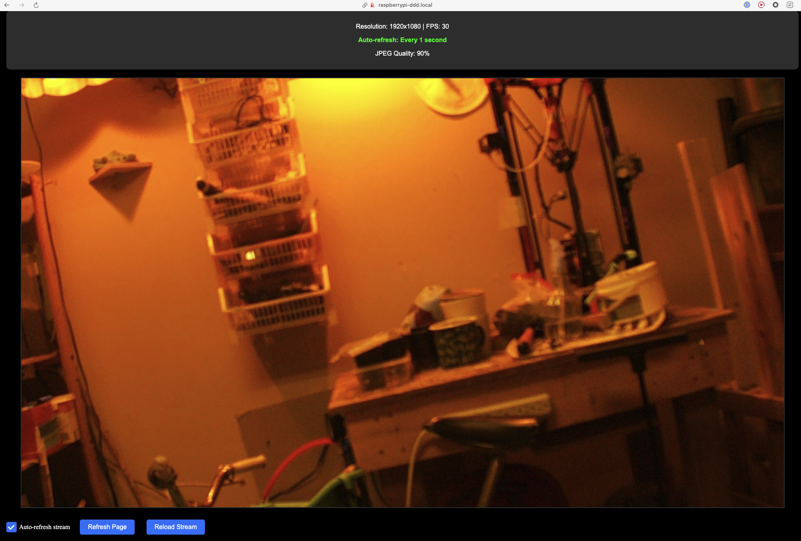
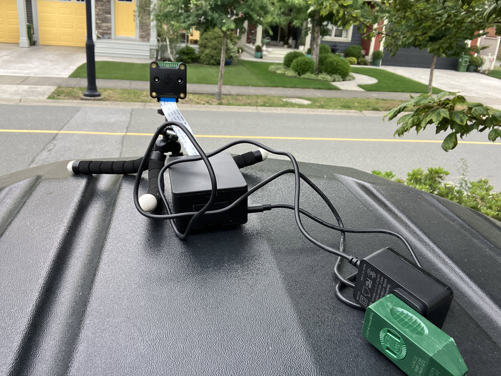
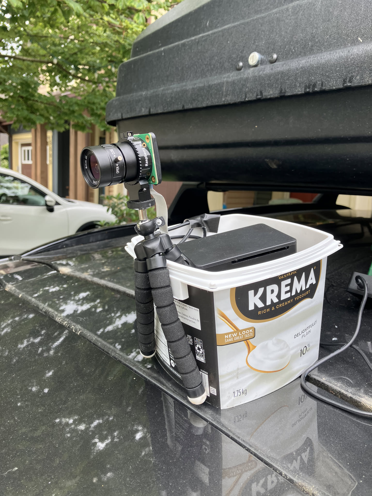
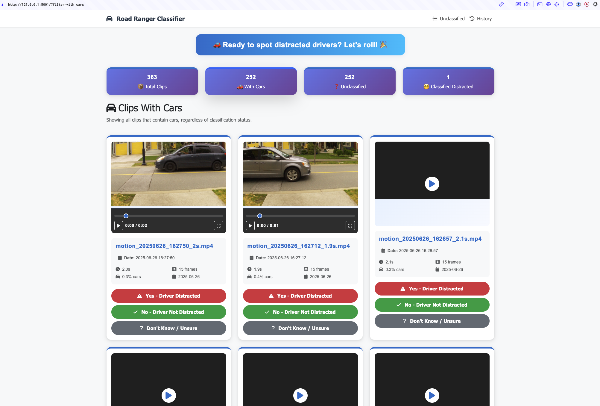

# Road Ranger 🏘️🚗🎥🤠🔍

This is a proof-of-concept of a distracted driving detector (DDD) that uses a camera pointed at a road to detect when someone driving by is distracted. It has been on my mind for a long time.

## 🌟 Motivation: Why Are We Doing This?

🚶‍♂️💨 **They Zip Past My Front Door** — Cars speed through my quiet neighborhood far too fast.

📵👀 **I Keep Catching Them on Their Phones** — It worries me how often I see a lit-up screen instead of eyes on the road.

😱✋ **Two Near-Misses Were Two Too Many** — I literally had to jump back at the crosswalk because the driver never saw me.

📊🗂️ **I Want Hard Proof, Not Anecdotes** — Data is usually a good way to make a difference.

🤖🪄 **Let the Bots Do the Boring Work** — My goal is for AI to handle 95% of the labeling so I can just review the tricky clips over a ☕.

> If we can measure it, we can fix it. ✨

## 🎯 Project Overview

This project implements a multi-phase approach to distracted driving detection. In the beginning there's all the infrastructure to record clips, do as much labelling of relevant clips (is there a 🚗?) and then a web interface to review the clips and classify the drivers as distracted or not. Without any assistance, this wouldn't be practical at a busy road because "luckily" most drivers are not distracted so you'd look at a lot of boring footage. My hope is that over time, more and more of the true negatives can be labelled by AI and the human review can be reduced to a few minutes a week.

Thanks to my employer [Clio](https://github.com/clio) I was able to spend almost 3 days of our "build it with AI" 2025 Hackathon building the first couple of milestones!!! 🎉 Thank you Clio!

1. **Motion Detection & Recording** ✅ - Automatically records video clips when motion is detected (Watcher)
2. **Car Detection** ✅ - Filters clips to identify those containing cars (Inspector)
3. **Manual Classification** ✅ - Web interface for human review and distraction classification (Classifier)
4. **Driver Detection** 🔄 - Identifies clips with visible drivers
5. **Distraction Detection** 🔄 - Analyzes driver behavior for signs of distraction

## Screenshots


*Complete hardware setup including Raspberry Pi, camera, and power supply*


*Helper web app for camera calibration and testing*


*Camera mounted and positioned to capture traffic on the road, early days, the Pi didn't have its shell yet*


*And here's the final version, the Pi got a shell now*


*The web-based classification interface for manually reviewing and labeling distracted driving clips*

## Next steps

What I learned most from this is that photography is hard, WiFi is a pain and people just drive their cars way too fast.

To make this a success, we need to:
- Solve the issue around quality/lighting of the video clips. There might be low hanging fruit here with the hardware we got.
- Once the quality is good enough, we can start to think about the AI part. Driver detection is a good start and "conventional" models like YOLOv8 might be good enough for this.
- Once we know there's a driver, we can start looking into distraction detection. Maybe there are specialized models out there, maybe LLMs could help here? 🤷‍♀️

## 🏗️ Architecture

The system is split into three specialized components:

### 🕵️ Watcher (Recording Side)
- **Software**: Python console app
- **Hardware**: Raspberry Pi 4 + Global Shutter Camera
- **Role**: Motion detection, video recording, storage
- **Dependencies**: Lightweight (OpenCV, Picamera2)
- **Location**: `watcher/` directory
- **Config**: `watcher/config.py` - Recording and motion detection settings

### 🔍 Inspector (Analysis Side)
- **Software**: Python console app
- **Hardware**: Standard Ubuntu server with more CPU/memory
- **Role**: ML processing, car detection, analysis
- **Dependencies**: Heavy ML libraries (YOLOv8, PyTorch)
- **Location**: `inspector/` directory
- **Config**: `inspector/config.py` - ML and analysis settings

### 🏷️ Classifier (Manual Review Side)
- **Software**: Python web app
- **Hardware**: Any device with web browser
- **Role**: Human review, distraction classification, data management
- **Dependencies**: Lightweight (Flask, SQLite)
- **Location**: `classifier/` directory
- **Config**: `classifier/config.py` - Web app and classification settings

## 🚀 Quick Start

### 1. Watcher Setup (Raspberry Pi)

```bash
cd watcher/

# Run the automated setup script
./setup.sh

# Start motion recording
python3 main.py
```

In the watcher output you'll see motion being detected and the clips stored locally.

### 2. Inspector Setup (Server)

```bash
cd inspector/

# Install pipenv
pip3 install --user pipenv

# Install ML dependencies
pipenv install

# Test installation
pipenv run test-yolo

# Continuously transfer clips from Watcher and analyze
./run_server_loop.sh
```

In the inspector output you'll see the clips being analyzed and the results stored in the database.

### 3. Classifier Setup (Web Interface)

```bash
cd classifier/

# Run the setup script
./setup.sh

# Start the web application
pipenv run start
```

Then open your browser to: **http://localhost:5001** and you'll see the web interface.

## ⚙️ Configuration

### Watcher Configuration (`watcher/config.py`)
```python
# Recording schedule
RECORDING_START_TIME = "08:00"  # 8 AM
RECORDING_END_TIME = "18:00"    # 6 PM

# Motion detection sensitivity
MOTION_THRESHOLD = 80           # Higher = less sensitive
MIN_MOTION_AREA = 1500          # Minimum area to trigger

# Storage settings
STORAGE_DIR = "recorded_clips"
CLIP_RETENTION_DAYS = 7
```

### Inspector Configuration (`inspector/config.py`)
```python
# YOLO model settings
MODEL_SIZE = 'n'                # n=nano, s=small, m=medium, l=large
CONFIDENCE_THRESHOLD = 0.5      # Minimum confidence for detection

# Processing settings
SAMPLE_FRAMES = 10              # Frames to sample per video
INPUT_SIZE = (640, 640)         # YOLO input size
```

### Classifier Configuration (`classifier/config.py`)
```python
# Flask settings
FLASK_HOST = "0.0.0.0"          # Listen on all interfaces
FLASK_PORT = 5001               # Port number

# Database settings
DATABASE_PATH = "../inspector/car_detection.db"  # Inspector database
VIDEO_DIR = "../inspector/downloaded_clips"      # Video files

# UI settings
MAX_VIDEOS_PER_PAGE = 20        # Clips per page
AUTO_PLAY_VIDEOS = False        # Auto-play option
```

## 📂 File Transfer Options

### Option 1: Manual SCP
```bash
scp -r user@raspberrypi-ddd.local:/home/tobi/ddd/watcher/recorded_clips/ ./inspector/
```

### Option 2: Network Share
```bash
# Copy to NAS from Watcher
cp watcher/recorded_clips/*.mp4 /mnt/nas/ddd_clips/

# Copy from NAS to Inspector
cp /mnt/nas/ddd_clips/*.mp4 ./inspector/
```

### Option 3: Automated Script
```bash
# Use the provided transfer script
./transfer_clips.sh
```

**Note**: The watcher uses atomic file operations to prevent partial file transfers. Files are written to a temporary location first, then moved to the final storage location only when complete.

## 🎬 Usage

### Phase 1: Motion Recording (Watcher)
```bash
cd watcher/
python3 main.py
```

### Phase 2: Car Detection (Inspector)
```bash
cd inspector/
pipenv run analyze-clips
```

### Phase 3: Manual Classification (Classifier)
```bash
cd classifier/
pipenv run start
```

Then open your browser to **http://localhost:5001** and:
1. Review unclassified clips that contain cars
2. Watch each video and classify as:
   - **Yes** - Driver is distracted
   - **No** - Driver is not distracted
   - **Don't Know** - Unable to determine (will appear again later)
3. Track progress with real-time statistics
4. Review classification history

### Complete Workflow
1. **Watcher** records motion-triggered video clips
2. **Inspector** analyzes clips for car detection and stores results in database
3. **Classifier** provides web interface for manual distraction classification
4. All components share the same database for seamless data flow

## ⚡ Performance Notes

### Watcher Optimization
- Lightweight dependencies only (installed via apt)
- Efficient motion detection with minimal CPU usage
- Automatic cleanup prevents storage overflow
- Configurable recording windows reduce unnecessary processing

### Inspector Optimization
- YOLOv8n model for speed
- Configurable confidence thresholds
- Frame sampling for efficiency
- Batch processing capabilities

### Classifier Optimization
- Efficient database queries with indexing
- Pagination for large datasets
- Responsive web design
- Keyboard shortcuts for quick classification

## 💻 Development

### Testing Components

**Watcher:**
```bash
cd watcher/
python3 test_motion_detection.py
python3 test_picamera2.py
```

**Inspector:**
```bash
cd inspector/
pipenv run test-yolo
pipenv run python test_car_detection.py
```

**Classifier:**
```bash
cd classifier/
pipenv run start
# Then test in browser at http://localhost:5001
```

### Adding Features
1. Keep Watcher side lightweight
2. Add ML features to Inspector side
3. Use file-based messaging between components
4. Test on actual hardware

## 🛠️ Troubleshooting

### Watcher Issues
- **Camera not detected**: Check connections and permissions
- **Motion detection issues**: Adjust thresholds in `watcher/config.py`
- **Storage full**: Enable cleanup in `watcher/config.py`

### Inspector Issues
- **YOLOv8 installation**: See `inspector/README.md` for setup instructions
- **Memory issues**: Use smaller model or increase sampling
- **Transfer issues**: Check network connectivity

### Classifier Issues
- **Database not found**: Make sure Inspector has been run first
- **Videos not loading**: Check video directory path in `classifier/config.py`
- **Port already in use**: Change port in `classifier/config.py`

## 🗂️ Project Structure

```
road-ranger/
├── watcher/                    # Recording & Motion Detection
│   ├── main.py                # Motion recording (RPi)
│   ├── motion_detector.py     # Motion detection (RPi)
│   ├── video_recorder.py      # Video recording (RPi)
│   ├── config.py              # Watcher configuration
│   ├── setup.sh               # Installation script
│   ├── recorded_clips/        # Video storage
│   └── README.md              # Watcher documentation
├── inspector/                  # ML Analysis & Car Detection
│   ├── yolo_car_detector.py   # YOLOv8 detection (server)
│   ├── yolo_car_table.py      # Analysis script (server)
│   ├── database.py            # Database management
│   ├── config.py              # Inspector configuration
│   ├── Pipfile               # Server dependencies
│   ├── server_setup.md        # Server setup guide
│   ├── downloaded_clips/      # Video storage
│   └── README.md              # Inspector documentation
├── classifier/                 # Manual Classification Interface
│   ├── app.py                # Flask web application
│   ├── database.py           # Database wrapper
│   ├── config.py             # Classifier configuration
│   ├── requirements.txt      # Python dependencies
│   ├── setup.sh              # Installation script
│   ├── templates/            # HTML templates
│   └── README.md             # Classifier documentation
└── README.md                  # This file
```

## 📜 License

This project is for research and educational purposes.

## 🙌 Contributing

1. Follow the lightweight Watcher / heavy Inspector architecture
2. Test on actual hardware
3. Update documentation in appropriate directories
4. Use file-based messaging between components

## 📦 Quick Commands

```bash
# Watcher (Raspberry Pi)
cd watcher/
python3 main.py

# Inspector (Server)
cd inspector/
./run_server_loop.sh
```
